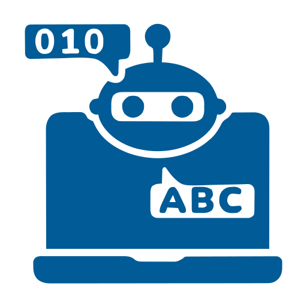

# Natural Commands Protocol (NCP)

<p align="center">
  
  
  
  
  
  
  
  
  
</p>
<p align="center">
  
</p>


## The Problem: The Interpretation Abyss

Today's computational systems face a fundamental dilemma:

**Rigid Syntax**  
Users spend hours learning complex formulas (Excel, SQL, programming languages). A single misplaced parenthesis breaks everything.

**AI Ambiguity**  
Large Language Models are brilliant but unpredictable. They hallucinate, change outputs on the same input, and are dangerous for critical calculations.

## The Solution: Natural Commands Protocol

**NCP stabilizes this abyss.**

It offers the flexibility of human speech with the rigidity of code. It's a **protocol specification** that ensures when a user says "add this," the system knows *exactly* which mathematical function to invoke—with zero room for unwanted computational "creativity."

```
Natural Language → NCP Schema → Deterministic AST → Reliable Execution
```

---

## What is NCP?

NCP is a **JSON-based protocol specification** that maps natural language expressions to computational operations. It's not a library or implementation—it's a standard that anyone can implement in any programming language.

### Key Principles

✅ **Protocol-First** - A specification, not an implementation  
✅ **Deterministic** - Same input always produces same result  
✅ **i18n Native** - Built-in support for multiple languages  
✅ **Zero Syntax** - Users never see parentheses or operators  
✅ **Extensible** - Easy to add new commands and languages  
✅ **Implementation Agnostic** - Works with any programming language  

---

## How It Works


### The Protocol Flow

1. **User Input** - Natural language expression
2. **Schema Lookup** - Parser reads `schema.json` and matches variants
3. **AST Generation** - Creates computational tree following `compute` spec
4. **Execution** - Executes based on `function`, `operator`, or `formula`

---

## NCP Is / Is Not

| NCP **IS** | NCP **IS NOT** |
|-----------|---------------|
| ✅ A protocol specification (JSON schema) | ❌ A software library or SDK |
| ✅ A semantic mapping standard | ❌ A large language model |
| ✅ Language-agnostic (implement anywhere) | ❌ Tied to specific tech stack |
| ✅ Designed for critical calculations | ❌ A general-purpose AI |
| ✅ Deterministic and predictable | ❌ Probabilistic or creative |
| ✅ i18n-first with variant support | ❌ English-only |
| ✅ Community-extensible | ❌ Fixed or proprietary |

---

## The Protocol Specification
The core of NCP is the **`schema.json`** file, which defines:

```json
{
  "version": "1.0.0",
  "schema": "natural-commands-i18n",
  "commands": [
    {
      "id": "op_add",
      "category": "arithmetic",
      "type": "operator",
      "compute": {
        "function": "ADD",
        "operator": "+",
        "arity": 2
      },
      "i18n": {
        "en": {
          "canonical": "add",
          "variants": ["add", "plus", "sum"],
          "slash": "/add",
          "template": "{a} plus {b}"
        }
      }
    }
  ]
}
```

### Schema Structure

- **`id`** - Unique command identifier
- **`category`** - Functional grouping (arithmetic, conditional, etc.)
- **`type`** - Computational type (operator, function, etc.)
- **`compute`** - Execution specification (function name, operator, formula, arity)
- **`i18n`** - Multi-language variants and templates

📖 **[Full Protocol Documentation](docs/PROTOCOL.md)**

---

## Protocol Coverage

NCP v1.0 includes 53 commands across 8 categories:

| Category | Count | Examples |
|----------|-------|----------|
| **Arithmetic** | 6 | add, subtract, multiply, divide, percentage |
| **Conditional** | 6 | if-then-else, when, whenever, while, until |
| **Comparison** | 6 | greater than, less than, equal to |
| **Date** | 9 | today, yesterday, days between, add days |
| **Functions** | 11 | max, min, average, sum, round, abs |
| **Logical** | 3 | and, or, not |
| **Text** | 6 | concat, contains, length, uppercase |
| **List** | 6 | filter, map, find, sort, first, last |

📁 **[View Full Schema](spec/commands.json)**

---

## Proof of Concept Implementations

While NCP is a protocol, we provide minimal reference implementations to **prove the concept works**:

### 1. Basic Computational Parser

Simple proof that the schema can be read and executed:

```python
# proof-of-concept/simple_parser.py
import json

def parse_and_execute(input_text, schema, context):
    # Find matching command in schema
    tokens = input_text.lower().split()
    
    for command in schema['commands']:
        for variant in command['i18n']['en']['variants']:
            if variant in tokens:
                # Execute based on compute spec
                if command['compute']['operator'] == '+':
                    return context['a'] + context['b']
    
    return None

# Test
schema = json.load(open('spec/commands.json'))
result = parse_and_execute("capital plus interest", schema, {'capital': 1000, 'interest': 50})
print(result)  # 1050
```

### 2. LLM Anti-Hallucination with MCP

Proof that NCP reduces hallucination when integrated with Model Context Protocol:

```python
# proof-of-concept/llm_grounding.py
from anthropic import Anthropic

def llm_with_ncp_grounding(user_query, schema):
    client = Anthropic()
    
    # Provide schema as context
    system_prompt = f"""
    You can only respond using commands from this schema:
    {json.dumps(schema['commands'], indent=2)}
    
    When user asks for calculation, respond with natural command that matches schema.
    """
    
    response = client.messages.create(
        model="claude-3-5-sonnet-20241022",
        system=system_prompt,
        messages=[{"role": "user", "content": user_query}]
    )
    
    return response.content

# Without NCP: LLM might hallucinate different syntax each time
# With NCP: LLM constrained to schema variants
```

📁 **[View All Proofs of Concept](proof-of-concept/)**

---

## Real-World Protocol Examples

### Financial Calculation (JSON)

```json
{
  "use_case": "tax_calculation",
  "expression": "if income greater than 50000 then 30% of income else 20% of income",
  "ncp_commands_used": [
    "logic_if",
    "comp_greater", 
    "op_percentage"
  ],
  "deterministic": true,
  "output_always": "consistent"
}
```

### Legal Compliance (JSON)

```json
{
  "use_case": "contract_deadline",
  "expression": "if contract date plus 30 days less than today then expired else active",
  "ncp_commands_used": [
    "logic_if",
    "date_add_days",
    "date_today",
    "comp_less"
  ],
  "deterministic": true
}
```

📁 **[More Examples](examples/)**

---

## Use Cases for NCP Protocol
### 1. **No-Code Platforms**
Implement NCP parser to allow users to write business logic in natural language.

### 2. **AI Agent Grounding**
Use NCP schema to constrain LLM outputs, reducing hallucination in critical calculations.

### 3. **Model Context Protocol Integration**
Expose NCP commands as MCP tools to provide structured calculation capabilities to LLMs.

### 4. **Legal Tech**
Enable lawyers to write contract logic following NCP protocol.

### 5. **Financial Services**
Implement NCP in financial platforms for calculation rule engines.

---

## Implementing the Protocol

Anyone can implement NCP in any language. The protocol requires:

1. **Schema Parser** - Read and index `schema.json`
2. **Variant Matcher** - Match user input to command variants
3. **AST Generator** - Build tree following `compute` spec
4. **Executor** - Execute based on `function`, `operator`, or `formula`

### Minimal Implementation Checklist

- [ ] Read `schema.json`
- [ ] Index all `variants` by language
- [ ] Match longest variant first (greedy)
- [ ] Respect `arity` for validation
- [ ] Execute using `compute.function` or `compute.operator`
- [ ] Support `compute.formula` for complex operations

📖 **[Implementation Guide](docs/IMPLEMENTATION.md)**

---

## Contributing to the Protocol

NCP is a community protocol. You can contribute:

### Adding New Commands
1. Propose new command in Issues
2. Define `id`, `category`, `type`, `compute`
3. Provide i18n variants (minimum: `en` and `pt`)
4. Submit PR with schema addition

### Adding New Languages
1. Add language code to existing commands
2. Provide `canonical`, `variants`, `slash`, `template`
3. Test with proof-of-concept parser
4. Submit PR

📖 **[Contributing Guide](CONTRIBUTING.md)**

---

## Protocol Governance

- **Versioning**: Semantic versioning (semver)
- **Breaking Changes**: Only in major versions
- **Command IDs**: Never change (stability guarantee)
- **Extensions**: Community proposals via Issues/PRs

---

## Resources

- 📖 **[Protocol Specification](docs/PROTOCOL.md)** - Complete technical spec
- 📋 **[Schema Reference](docs/SCHEMA.md)** - All attributes explained
- 🔧 **[Implementation Guide](docs/IMPLEMENTATION.md)** - How to implement
- 💡 **[Use Case Examples](examples/)** - Real-world scenarios
- 🧪 **[Proof of Concept Code](proof-of-concept/)** - Minimal implementations
- 🗣️ **[Discussions](https://github.com/username/natural-commands-protocol/discussions)** - Community forum

## License


This protocol specification is released under the **Creative Commons Attribution 4.0 International (CC-BY-4.0) License**.

Implementations of this protocol can use any license.

## Authors & Contributors

<table align="center">
  <tr>
    <!-- Sacrossantos Silva -->
    <td align="center">
      <a href="https://github.com/w2s2k" target="_blank">
        <br>
        <sub><b>Sacrossantos Silva</b></sub>
      </a>
    </td>
    <!-- ChatGPT -->
    <td align="center">
      <a href="https://openai.com/blog/chatgpt" target="_blank">
        <br>
        <sub><b>ChatGPT</b></sub>
      </a>
    </td>
    <!-- Claude -->
    <td align="center">
      <a href="https://www.anthropic.com/claude" target="_blank">
        <br>
        <sub><b>Claude by Anthropic</b></sub>
      </a>
    </td>
    <!-- Google AI Mode -->
    <td align="center">
      <a href="https://ai.google/" target="_blank">
        <br>
        <sub><b>Google AI Mode</b></sub>
      </a>
    </td>
  </tr>
</table>

<p align="center" style="font-size:2rem;margin-top:4rem">
<i>Vibecoding™ – powered by me pretending to understand and some(times) obedient AIs 🤖</i>
</p>

---

<p  align="center"><a href="https://github.com/w2s2k/natural-commands-protocol">Natural Commands Protocol</a> © 2026 by <a href="https://github.com/w2s2k">Sacrossantos Silva</a> is licensed under <a href="https://creativecommons.org/licenses/by-sa/4.0/">CC BY-SA 4.0</a></p>